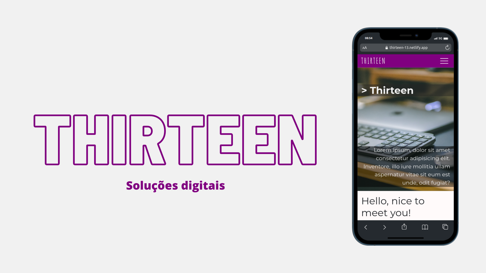
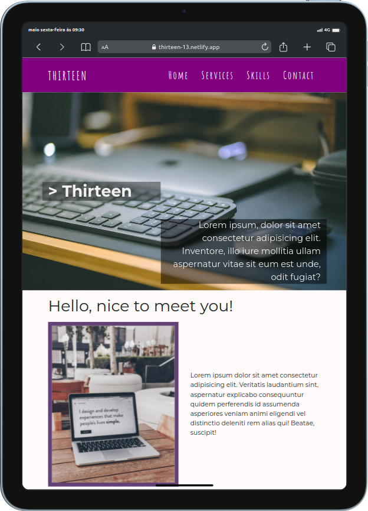
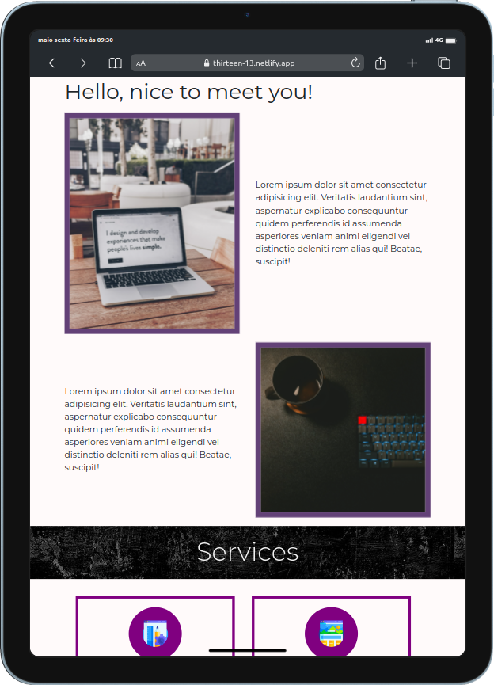
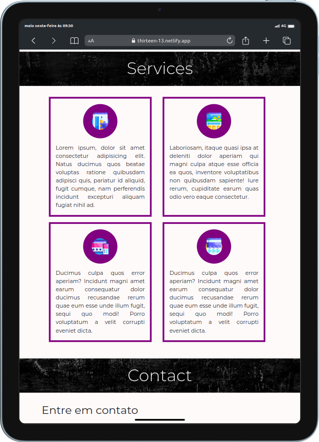

<h1 align="center">
    
</h1>

# Thirteen

> Thirteen, a solução para seus problemas - https://thirteen-13.netlify.app/

## 🎨 Layout

  

  

  

  

## 🛠 Tecnologias

As seguintes ferramentas foram usadas na construção do projeto:

<code></code>
<code></code>
<code></code>
